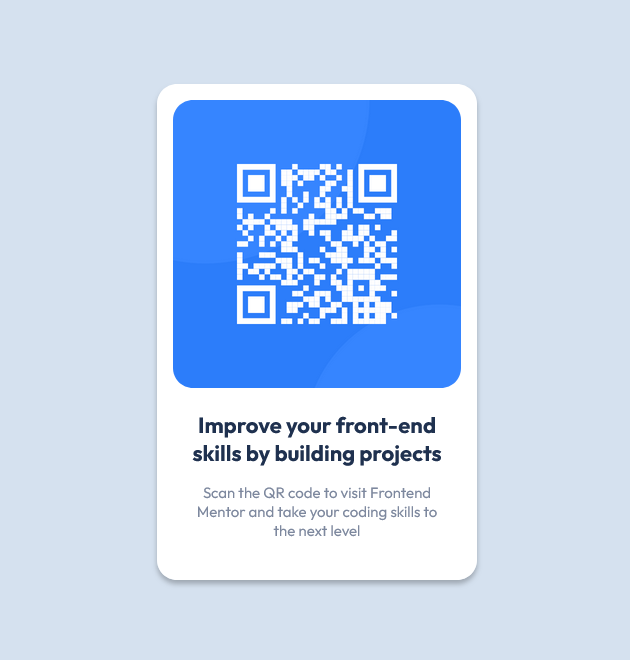

# Frontend Mentor - QR code component solution

This is a solution to the [QR code component challenge on Frontend Mentor](https://www.frontendmentor.io/challenges/qr-code-component-iux_sIO_H). Frontend Mentor challenges help you improve your coding skills by building realistic projects.

## Table of contents

- [Overview](#overview)
  - [Screenshot](#screenshot)
  - [Links](#links)
- [My process](#my-process)
  - [Built with](#built-with)
  - [What I learned](#what-i-learned)
  - [Continued development](#continued-development)
  - [Useful resources](#useful-resources)
- [Author](#author)
- [Acknowledgments](#acknowledgments)

## Overview

### Screenshot



### Links

- Solution URL: [Frontend Mentor](https://www.frontendmentor.io/solutions/qr-code-component-main-just-using-html-and-css-VfbqZmSmyW)
- Live Site URL: [Hosted on Netlify](https://sunny-twilight-835840.netlify.app/)

## My process

### Built with

- Semantic HTML5 markup
- CSS custom properties
- Flexbox to center the card
- Used Emmet to write HTML quicker

### What I learned

Learned how to easily center a card element on a entire empty website with:

```css
.container {
  height: 100vh;
  display: flex;
  justify-content: center;
  align-items: center;
}
```

Become familiar with figma to create more precise challenge solutions. And hosted a solution on netlify for the first time to provide a live site from the challenge.

### Continued development

Next time I don't want to use pixel values for font-size, padding, margin and so on and use em or rem instead.

### Useful resources

- [Flexbox Crash Course 2024 by Traversy Media - YouTube](https://www.youtube.com/watch?v=3YW65K6LcIA) - This helped me for understanding flexbox. I really liked his teaching style and the pace, because it's perfect for coding the examples by yourself while watching/listening him.
- [Box Shadow - MDN](https://developer.mozilla.org/en-US/docs/Web/CSS/box-shadow) - This helped me for using the box-shadow property.

## Author

- Website - Coming soon
- Frontend Mentor - [@rud0va](https://www.frontendmentor.io/profile/rud0va)

## Acknowledgments

Traversy Media's content really helped me learn everything I needed.
